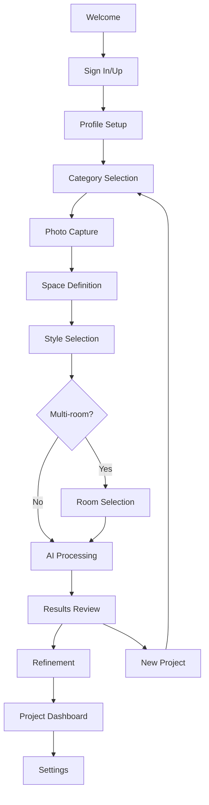

# User Journey: Project Wizard Flow

## Overview
A comprehensive step-by-step journey for users to create AI-generated interior designs with guided validation and clear progression.

## Journey Steps

### Phase 1: Onboarding & Authentication
1. **Landing/Welcome Screen** 
   - App introduction and value proposition
   - Sign up / Sign in options
   - Guest mode option (limited features)

2. **Profile Setup Screen** (Optional for new users)
   - Basic profile information
   - Design preferences survey
   - Subscription tier selection

### Phase 2: Project Creation Wizard (6 Steps)

#### Step 1: Category Selection ✅ DONE
- **Screen**: `CategorySelectionScreen` 
- **Purpose**: Choose project type (Interior, Garden, Surface, Object, Exterior)
- **Validation**: Category compatibility with user plan
- **Next**: Photo Capture

#### Step 2: Photo Capture 
- **Screen**: `PhotoCaptureScreen` (1601 lines - NEEDS REFACTOR)
- **Purpose**: Capture or import space photo
- **Features**: Camera interface, gallery import, photo guidelines
- **Validation**: Image quality, format, size checks
- **Next**: Room/Space Definition

#### Step 3: Space Definition
- **Screen**: `SpaceDefinitionScreen` (767 lines - NEEDS REFACTOR)
- **Purpose**: Define room type and space characteristics
- **Features**: Room type selection, dimensions, current state
- **Validation**: Compatibility with category selection
- **Next**: Style Selection

#### Step 4: Style Selection
- **Screen**: `StyleSelectionScreen` (679 lines - NEEDS REFACTOR)
- **Purpose**: Choose design style and aesthetic preferences
- **Features**: Style gallery, mood boards, style mixing
- **Validation**: Style availability for selected category/room
- **Next**: Project Requirements (if needed) or Processing

#### Step 5: Room Selection (Conditional)
- **Screen**: `RoomSelectionScreen` (584 lines - NEEDS REFACTOR)
- **Purpose**: Select specific rooms for multi-room projects
- **Features**: Room checklist, priority ranking
- **Validation**: Plan limits, room compatibility
- **Next**: Processing

#### Step 6: AI Processing
- **Screen**: `AIProcessingScreen` (1520 lines - NEEDS REFACTOR)
- **Purpose**: AI image generation with progress tracking
- **Features**: Real-time progress, estimation, preview generation
- **Validation**: Generation success, quality checks
- **Next**: Results & Refinement

### Phase 3: Results & Refinement
7. **Results Review Screen**
   - Generated design showcase
   - Before/after comparison
   - Basic editing options

8. **Image Refinement Screen** (from Wizard-Screen/panels)
   - Advanced editing and variations
   - Style adjustments
   - Material swapping

### Phase 4: Project Management
9. **Project Dashboard**
   - All user projects
   - Recent activity
   - Quick actions

10. **Settings Screen**
    - Account settings
    - Preferences
    - Subscription management
    - Privacy controls

## Screen File Structure (Target: <400 lines each)

```
/04-project-wizard/
├── shared/                          # Shared components (✅ DONE)
│   ├── components/                  # Reusable UI components
│   ├── hooks/                       # Business logic hooks  
│   └── constants/                   # Shared constants
├── CategorySelectionScreen.tsx      # 296 lines ✅ DONE
├── PhotoCaptureScreen/              # Split into components
│   ├── PhotoCaptureScreen.tsx       # Main screen <400 lines
│   ├── components/
│   │   ├── CameraInterface.tsx
│   │   ├── PhotoGuidelines.tsx
│   │   └── ImagePreview.tsx
│   └── hooks/
│       └── usePhotoCapture.ts
├── SpaceDefinitionScreen/           # Split into components
├── StyleSelectionScreen/            # Split into components  
├── RoomSelectionScreen/             # Split into components
├── AIProcessingScreen/              # Split into components
└── Wizard-Screen/                   # Unified screen ✅ DONE
```

## Navigation Flow



## Key Design Principles

1. **Progressive Disclosure**: Show only relevant options based on previous selections
2. **Clear Progress**: Always show step X of Y with visual progress bar
3. **Validation Gates**: Validate each step before allowing progression
4. **Smart Defaults**: Pre-select common options to reduce friction
5. **Graceful Fallbacks**: Handle errors and edge cases elegantly
6. **Responsive Layout**: Adapt to different screen sizes
7. **Accessibility**: Screen reader support, high contrast, large touch targets

## Error Handling Strategy

- **Network Issues**: Offline mode, retry mechanisms
- **Validation Failures**: Clear error messages with recovery actions
- **AI Generation Failures**: Fallback options, manual alternatives
- **Photo Issues**: Quality guidance, format conversion

## Performance Considerations

- **Lazy Loading**: Load screens on demand
- **Image Optimization**: Compress and resize images
- **Caching**: Cache user selections and API responses
- **Analytics**: Track user journey bottlenecks

## A/B Testing Points

- Category presentation (grid vs list)
- Photo capture flow (guided vs free-form)  
- Style selection method (swipe vs grid)
- Progress indication style
- Validation messaging tone